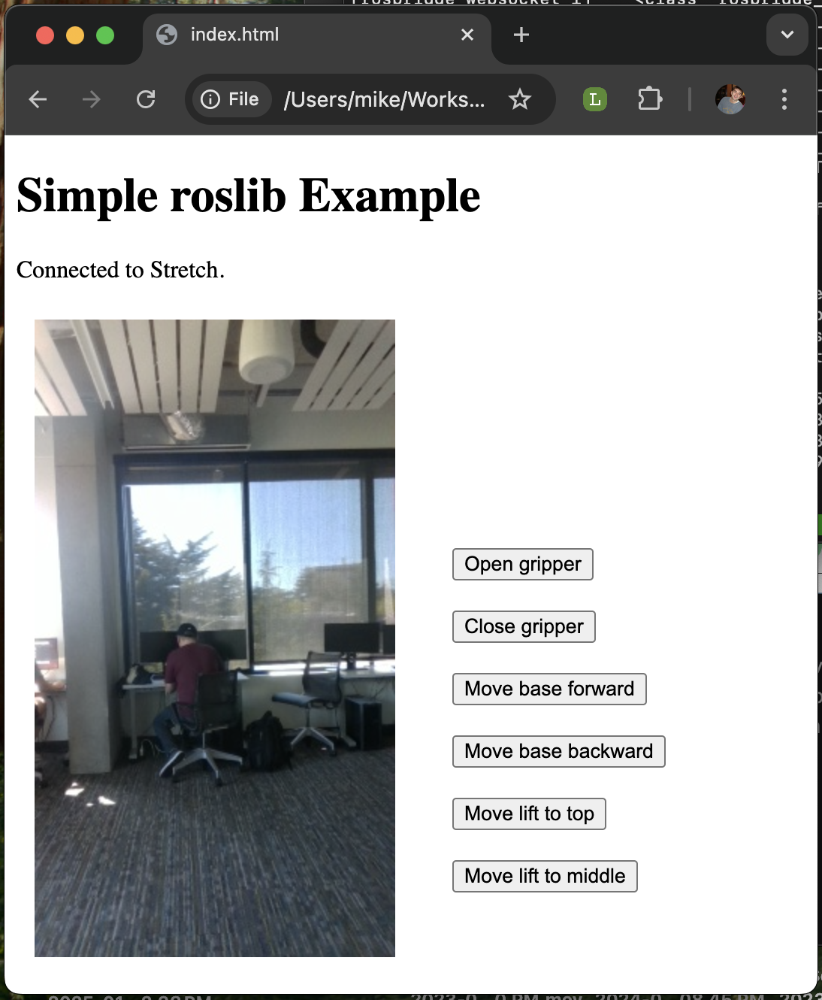

# cse481c_robot_web_teleop

This is a simple example interface for the Stretch robot using roslibjs. This code (in `index.html`) is intended to be used as reference or as a template for CSE481C Robotics Capstone projects.

## Usage

First, connect to the stretch using SSH.

Run the following commands (in three separate terminals for now, but later we will learn about creating custom launch files to avoid opening so many terminals!)

Stretch driver:
```
ros2 launch stretch_core stretch_driver.launch.py
```

Intel RealSense camera driver:
```
ros2 launch stretch_core d435i_low_resolution.launch.py
```

ROSBridge WebSocket server
```
ros2 launch rosbridge_server rosbridge_websocket_launch.xml
```

Finally, open the index.html page in your browser. You should see a page that looks like this:



